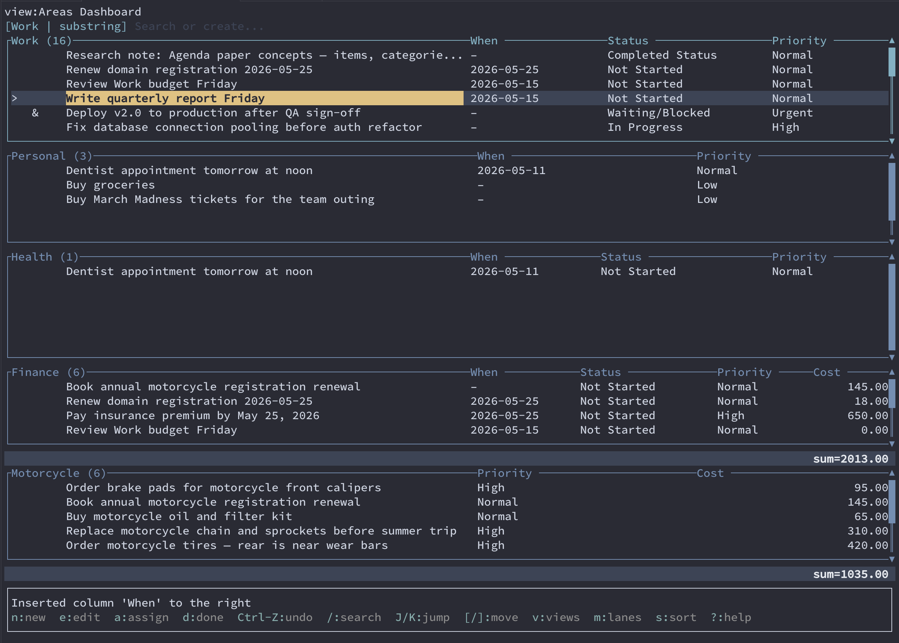
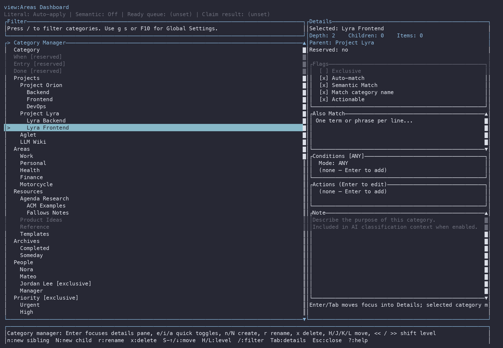
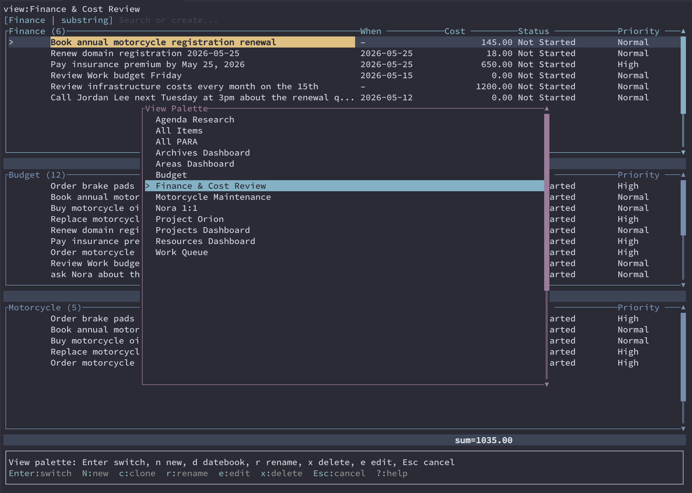
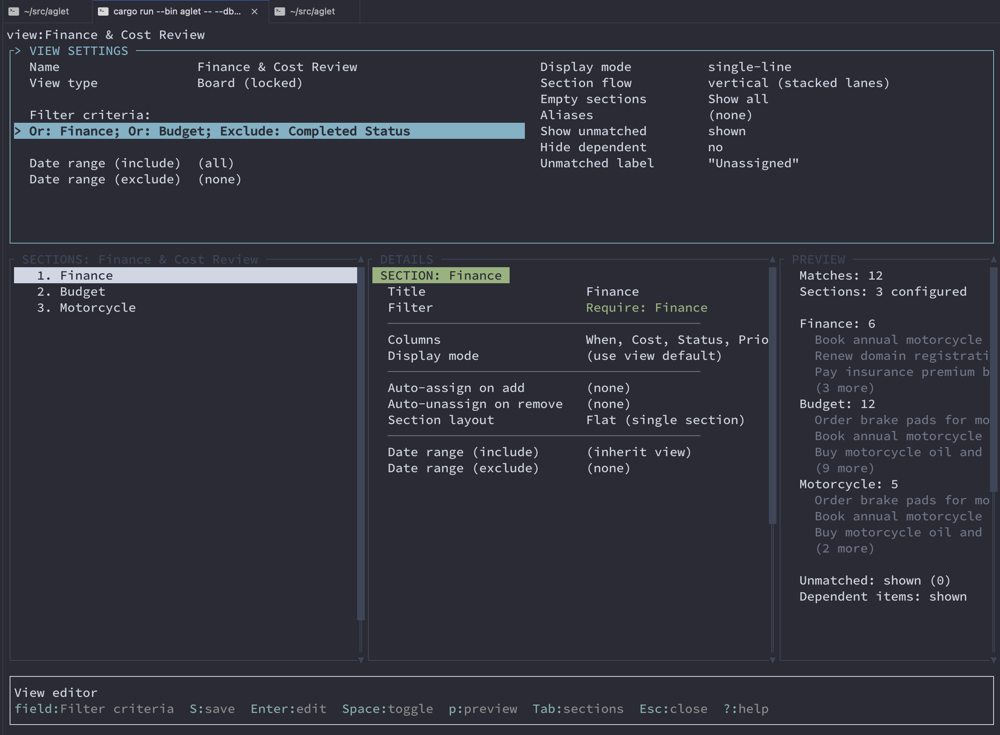
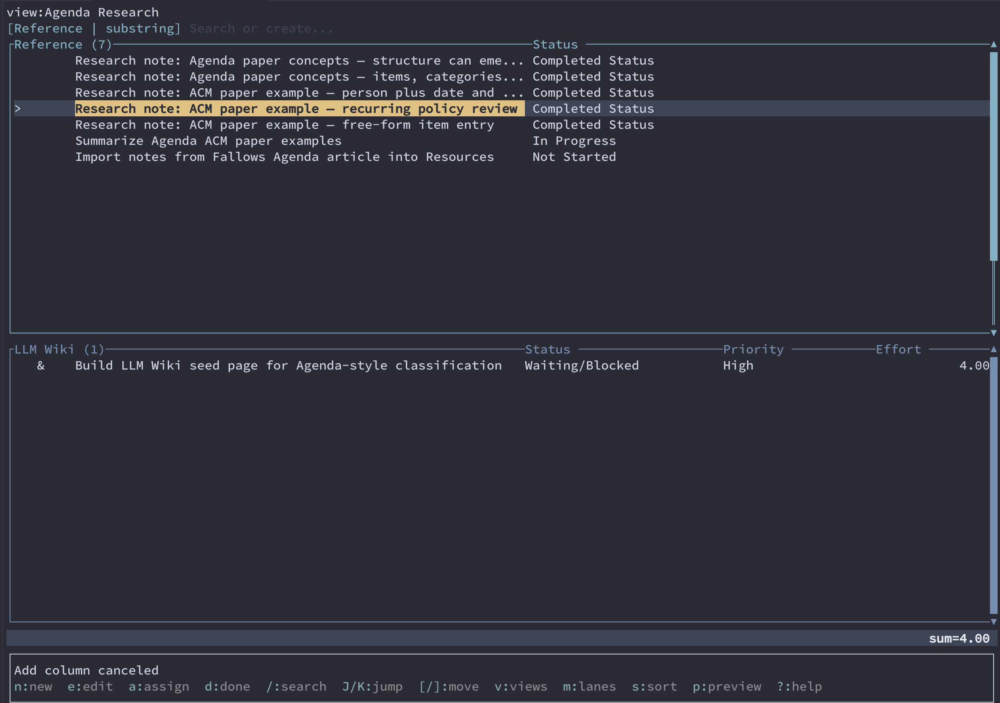
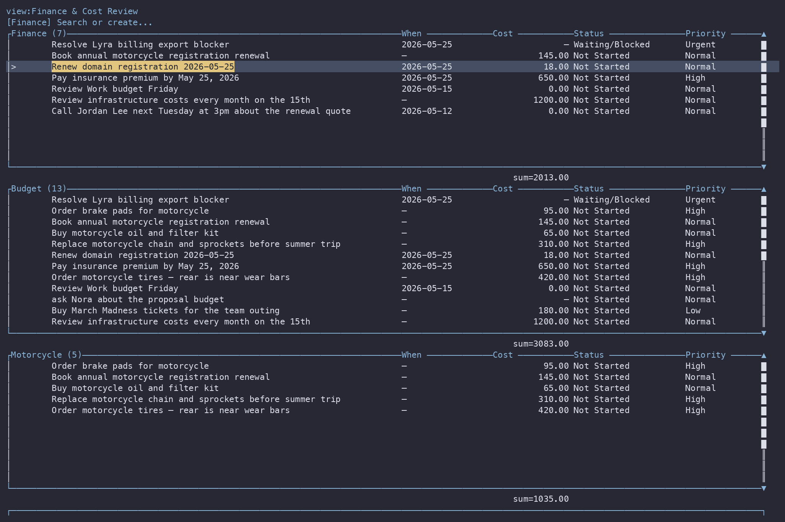
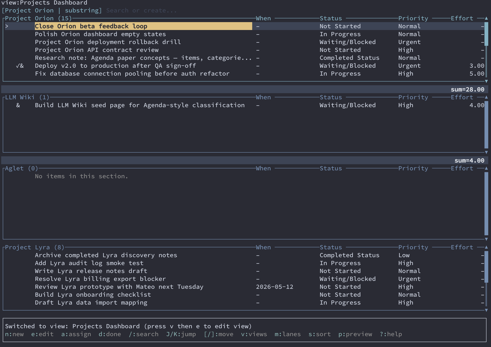
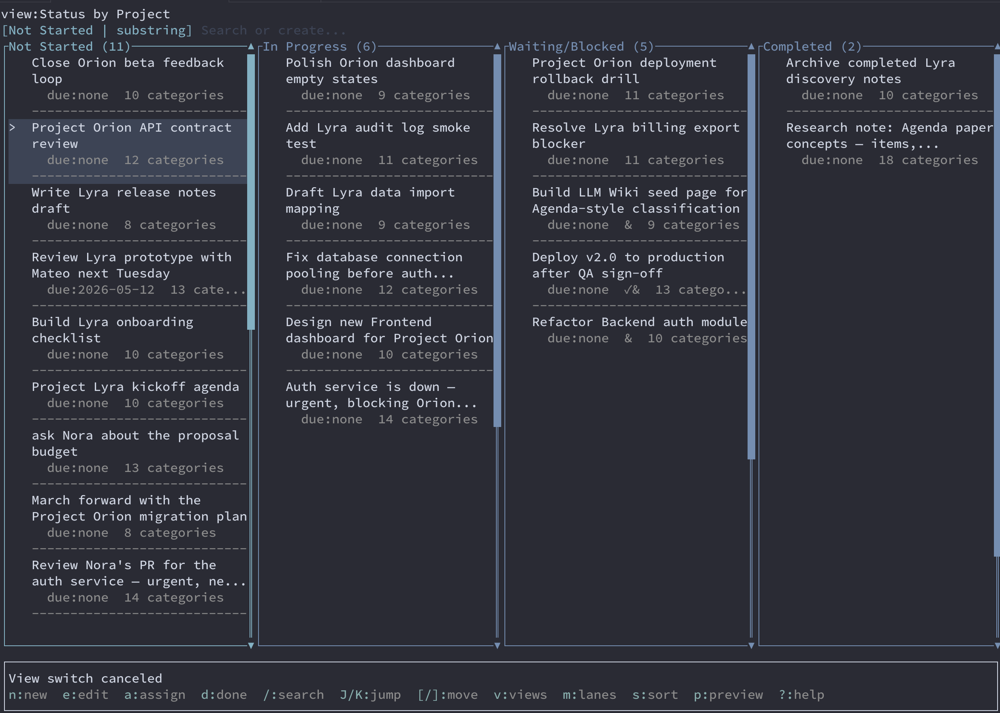

# aglet

aglet is a free-form personal information manager (PIM) modeled after [Lotus
Agenda](https://en.wikipedia.org/wiki/Lotus_Agenda), re-imagined as a modern
TUI.

It allows you to input unstructured notes and to-dos, then categorize them
either manually or with automatic rules based on the text (in aglet there is
experimental support for LLM-based categorization).

This is a project I've had in my mind for literally 20 years, ever since watching the slow motion [Chandler](https://www.dreamingincode.com/) disaster unfold in realtime back in the 2000's and learning about the original Lotus Agenda that was its inspiration.


Currently I use this software to manage my GTD-style todo list, track basic
financial budgets and recurring bills, and track motorcycle maintenance. It
also acts as a backing store for my own personal knowledgebase db, inspired by
Andrej Karpathy's [LLM
wiki](https://gist.github.com/karpathy/442a6bf555914893e9891c11519de94f)
concept, and Garry Tan's [gbrain](https://github.com/garrytan/gbrain).


Aglet views act as dashboards over the same database: todo lists, project plans, research notes, finance tracking, and agenda lists are all saved perspectives of the same items, organized by categories.

Screenshot:




## What was Lotus Agenda?

1. Kapor/Belove/Kaplan ACM paper (1990):
   - PDF: https://dl.acm.org/doi/pdf/10.1145/79204.79212
   - DOI page: https://dl.acm.org/doi/10.1145/79204.79212

2. Fallows Atlantic article (May 1992):
   - Title: "Hidden Powers: Agenda Can Organize Your Life Better Than Ordinary Programs"
   - URL: https://cdn.theatlantic.com/media/archives/1992/05/269-5/132676110.pdf
   - Bonus — the draft text: https://www.bobnewell.net/agenda/atlantic.txt.html

## What is aglet?

aglet is a Rust TUI for managing items, categories, views, and item dependency
links. It also includes a CLI, primarily for ease of use by LLM coding agents.

It currently implements the basic feature set of Lotus Agenda. aglet's
keybindings are different, but otherwise pretty much all of the historical
Agenda articles and tutorials you can find online can be accomplished within
aglet.

Of the original Lotus Agenda, Wikipedia notes 
> Its flexibility proved to be its weakness. New users confronted with so
> much flexibility were often overpowered by the steep learning curve required
> to use the program."

But aglet is experimental software built by and for a single person (me). Part
of the motivation is to revisit some of these concepts and see if there is
anything to be learned, are there concepts or ideas ready to be revived 35+
years later.


## Quick Start

```bash
cargo run --bin aglet -- --db aglet-features.ag
cargo run --bin aglet -- --db aglet-features.ag list --view "All Items"
```

Running `aglet` without a subcommand opens the TUI.  

## Getting Started

aglet stores everything in a SQLite database file. The examples below use
`getting-started.ag`; replace that path with any `.ag` file you want to keep
using.

```bash
cargo run --bin aglet -- --db getting-started.ag
```

The first screen is a view over your items. If the database is new, aglet
creates the built-in categories and the `All Items` view for you. Press `?` at
any time to open the full in-app help panel.

### Add items

1. Press `n` to open the new-item editor.
2. Type an item, such as `Review Work budget Friday`.
3. Use `Tab` to move through the editor fields. Add a note if you want longer
   context.
4. Press `ctrl-s` to save, or `Esc` to cancel.
5. Repeat for a few more items, such as `Buy groceries` or `Schedule motorcycle
   maintenance next week`.

aglet parses dates from item text when it can, and matching category names in
the item text or note can be assigned automatically.

### Add categories

Categories are the basic filing system. A category can be assigned manually,
or, when implicit string matching is enabled, aglet can assign it automatically
when the category name appears in an item's text or note.

1. Press `c` or `F9` to open the category manager.
2. Press `n` to create a category at the selected category's level, or `N` to
   create a child category.
3. Enter names like `Work`, `Personal`, and `Urgent`.
4. Use the details pane to adjust category settings such as exclusivity,
   implicit matching, and notes.
5. Press `S` to save category edits, then `Esc` to return to the main view.

To assign a category manually, return to the main view, select an item, press
`a`, choose a category, and press `Space` to toggle the assignment. Press
`Enter` to close the picker.



### Add views

Views are saved lenses over the same item database. A view can focus on a
category, hide completed items, and group matching items into sections.

1. Press `v`, `V`, or `F8` to open the view picker.
2. Press `n` to create a new view.
3. Name it something like `Work Queue`.
4. Add criteria such as include `Work` and exclude `Done`.
5. Add sections if you want grouped lanes, such as an `Urgent` section that
   includes the `Urgent` category.
6. Press `S` to save the view.

Include criteria are AND-based, so a view with both `Work` and `Urgent`
includes only items that have both categories. Use OR criteria when any one of
several categories should match.



The view editor configures filters, sections, columns, layout, aliases, and
preview behavior.



### Example saved views

A research view can group reference notes and follow-up work while sharing the
same status model as task views.



A finance view can use numeric columns and section totals for budgets, renewal
costs, or maintenance planning.



A Project dashboard can show the same items grouped by project with task metadata
such as status, priority, dates, and effort.



The same project work can also be viewed Kanban-style by status, with horizontal
lanes for Not Started, In Progress, Waiting/Blocked, and Completed.



### Keybinding Cheat Sheet

| Area | Keys | Action |
| --- | --- | --- |
| Items | `n` | Add a new item to the focused section |
| Items | `e` / `Enter` | Edit the selected item; `Enter` adds when the view is empty |
| Items | `a` | Assign categories to the selected item or selection |
| Items | `d` / `D` | Toggle done on selected item(s) |
| Items | `r` / `x` | Remove from view / delete selected item(s) |
| Items | `b` / `B` | Open dependency link wizard: blocked-by / blocks |
| Navigation | `Up` / `k`, `Down` / `j` | Move between items |
| Navigation | `Left` / `h`, `Right` / `l` | Move between sections or columns |
| Navigation | `Tab` / `Shift-Tab` | Move to next / previous section |
| Navigation | `J` / `K` | Jump to next / previous section |
| Selection | `Space` | Toggle selection on current item |
| Selection | `Esc` | Clear selection or active section filter |
| Search | `/` | Search the focused section |
| Search | `g/` | Search all sections |
| Views | `v` / `V` / `F8` | Open the view picker |
| Views | `,` / `.` | Previous / next view |
| Views | `ga` | Jump to `All Items` |
| Categories | `c` / `F9` | Open the category manager |
| Columns | `+` / `-` | Add / remove a board column |
| Columns | `H` / `L` | Move board column left / right |
| Datebook | `{` / `}` / `0` | Browse previous period / next period / return to today |
| Global | `?` | Toggle help |
| Global | `Ctrl-L` | Reload data from disk |
| Global | `Ctrl-Z` / `Ctrl-Shift-Z` | Undo / redo |
| Global | `q` | Quit |

## Standalone Binary Build

Build a release-mode standalone package for the current platform:

```bash
scripts/build-standalone-aglet.sh
```

The package is written to `dist/aglet-<version>-<platform>.tar.gz` with a
matching SHA-256 checksum file. GitHub Actions runs the same procedure on every
pull request, and publishes the packaged binaries to the `aglet-latest`
prerelease when changes land on `main` or `master`.

## References

- Bob Newell's Agenda Page. — Archive of original documentation, FAQs, macros,
  and add-ons. <https://www.bobnewell.net/agenda.html>
- Kapor, M., Belove, E., Kaplan, J. (1990). "AGENDA: A Personal Information
  Manager." *Communications of the ACM*, 33(7). — The foundational paper
  describing the item/category data model.
  [PDF](https://dl.acm.org/doi/pdf/10.1145/79204.79212) ·
  [DOI](https://dl.acm.org/doi/10.1145/79204.79212)
- Fallows, James. (May 1992). "Hidden Powers: Agenda Can Organize Your Life Better
  Than Ordinary Programs." *The Atlantic Monthly*. — The best plain-English
  description of what Agenda does and why it matters.
  [PDF](https://cdn.theatlantic.com/media/archives/1992/05/269-5/132676110.pdf) ·
  [Draft text mirror](https://www.bobnewell.net/agenda/atlantic.txt.html)
- Ormandy, Tavis. (2020). "Lotus Agenda." — Modern hands-on exploration with
  working examples. <https://lock.cmpxchg8b.com/lotusagenda.html>
