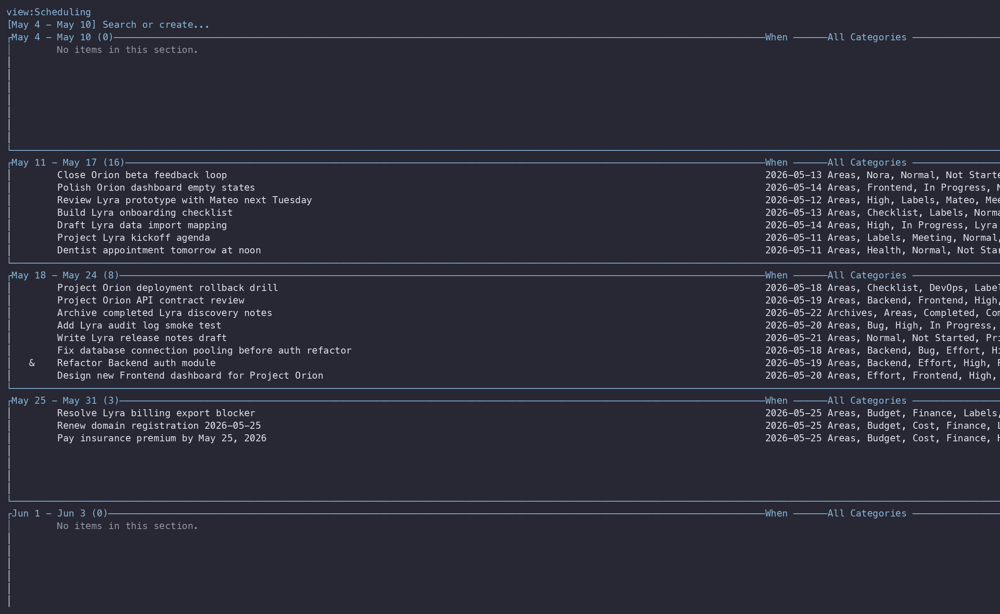

<!-- GENERATED from docs/src/.htm — DO NOT EDIT. Run   MD   aglet-tui.md in docs/. -->

# Aglet Reference — Concepts

[« Home](index.md)  \| 
[TUI Guide](aglet-tui.md)  \| 
[CLI Reference](aglet-cli.md)

## How to Use This Manual

Purpose  
Core concepts in aglet: items, categories, views, and the rules that
connect them. This document explains what things ARE; for how to operate
them see the [TUI Guide](aglet-tui.md) or the
[CLI Reference](aglet-cli.md).

**See also**   [Home](index.md)

## Overview

### About Aglet

<figure>

<figcaption aria-hidden="true">An aglet board: items grouped into sections, with When, Status, Priority, and Cost columns.</figcaption>
</figure>

Purpose  
Aglet is a personal information manager that gives you control over tasks,
notes, facts, numbers, and dates. You capture information as short items,
then organize them with categories and look at them through views.

Uses  
People use aglet to:

- Keep a GTD-style to-do list
- Track budgets and bills
- Plan and track projects
- Collect research notes
- Build a personal knowledgebase
- Track maintenance logs

How it works  
You type information first and structure it afterward. Aglet can also
assign categories automatically when a category name appears in an item's
text or note. The same items can appear in many views at once, each a
different perspective on the same database.

Basic steps  
1.  Enter items of information.
2.  Organize them into categories (by hand or automatically).
3.  Display views of those items and categories.

Interfaces  
Aglet has two faces over one SQLite database:

- A TUI — the interactive terminal interface (run `aglet`).
- A CLI — one-shot commands for scripts and agents.

**See also**  
[Items](#items), [Categories](#categories),
[Views](#views), [Quick start](#quick-start)

### Starter Workflows

Purpose  
Aglet has no fixed application templates. Instead, the same items can serve
many purposes by organizing them into views. Here are common ways people
set aglet up.

To-do list  
Capture tasks as items. Create a Priority category (exclusive, with
High/Normal/Low children) and a Status category. Make a "Today" or "Next"
view that includes the categories you want to focus on and excludes Done.

Finance  
Create numeric categories such as Cost or Amount. Group bills and budget
lines into a view with sections per area and a per-section column total
(Sum).

Projects  
Create a Project category with one child per project. View the same items
grouped by project, with columns for status, priority, and effort, or as a
Kanban board by status.

Knowledgebase  
Capture reference notes as items with longer notes attached. Tag them by
topic and group them in a research view alongside follow-up tasks that
share the same status model.

Scheduling  
Give items a When date. A datebook view buckets dated items into calendar
ranges so upcoming work and deadlines line up.

**See also**  
[Views](#views), [Numeric categories](#numeric-categories),
[Datebook views](#datebook-views)

### Quick Start

Purpose  
Get a working database and add your first items.

The database  
Aglet keeps everything in one SQLite file with a `.ag`
extension. Choose a path; it is created on first use. You can name the
database two ways:

- `--db work.ag` on every command, or
- `AGLET_DB=work.ag` exported once in your shell.

Open the TUI  
    aglet --db work.ag

Running aglet with no command opens the TUI. On a new database aglet creates
the reserved categories and the All Items view for you. Press
`?` at any time for the in-app help panel.

Add an item  
1.  Press `n` to open the new-item editor.
2.  Type an item, such as: `Review Work budget Friday`
3.  Press `Tab` to move to the note field; add longer context.
4.  Press `Ctrl-S` to save. (Enter also saves from the title
    field; Esc cancels.)

From the CLI  
    aglet --db work.ag add "Buy groceries" --note "Milk, eggs"
    aglet --db work.ag list

Next  
Add categories (`c`), then a view (`v`) to focus the
list.

**See also**  
[Add an item](aglet-tui.md#add-an-item),
[Add a category](aglet-tui.md#add-a-category),
[Create a view](aglet-tui.md#create-a-view),
[About .ag files](aglet-cli.md#about-ag-files)

## Core Concepts

### Items

Purpose  
An item is a line or two of information that you want to keep track of in
aglet. You can assign each item to any number of categories.

Examples  
- Call newspapers today to respond to stories about costs.
- Fix database connection pooling.
- Meeting with whole staff every Thursday at 11:00.

Parts  
- Text — the short title (up to about 350 characters).
- Note — optional longer text attached to the item.
- Dates — Entry (created), When (to happen), Done.
- Status — open or done.
- Links — dependencies and relations to other items.

Note  
To add more text than the title holds, attach a note. Aglet parses dates
from item text when it can, and matching category names in the text or
note can be assigned automatically.

**See also**  
[Add an item](aglet-tui.md#add-an-item),
[Notes](#notes), [Categories](#categories),
[Mark an item done](aglet-tui.md#mark-an-item-done),
[Dependencies](#dependencies)

### Categories

Purpose  
Categories are names you use to group related items. An item can be
assigned to many categories at once (multifiling).

How they work  
Categories are hierarchical: each category can have a parent and children.
You display and change the hierarchy in the category manager.

    Priority
      High
      Normal
      Low

Types  
Aglet has two value kinds of category:

| Kind    | Symbol | Contents                                      |
|---------|--------|-----------------------------------------------|
| Tag     |        | Boolean membership: the item is in it or not. |
| Numeric | `N`    | Carries a decimal value per item (Cost, Qty). |

In addition, categories can be marked Exclusive (only one child assignable
per item) and can use automatic assignment (implicit string matching),
conditions, and actions.

Reserved  
Every database has the reserved categories Done, When, and Entry. They
cannot be modified, deleted, or used as child category names.

**See also**  
[Tag categories](#tag-categories),
[Numeric categories](#numeric-categories),
[Exclusive categories](#exclusive-categories),
[The hierarchy](#the-category-hierarchy),
[Automatic assignment](#automatic-assignment),
[Reserved categories](#reserved-categories)

### Views

<figure>

<figcaption aria-hidden="true">The view palette lists every saved lens over the same items.</figcaption>
</figure>

Purpose  
A view is a saved perspective over the same items. Each view can filter to
certain categories, hide completed items, group items into sections, and
show custom columns. A database can hold many views.

Examples  
- A "Work Queue" view shows open work tasks by priority.
- A "Finance" view shows bills grouped by area with totals.
- A "Projects" view groups the same items by project.
- A "Scheduling" datebook view shows dated items by week.

How they work  
A view does not own items; it selects them. Add an item and it appears in
every view whose criteria it meets. Views are saved lenses, not separate
lists.

**See also**  
[Standard views](#standard-views),
[Datebook views](#datebook-views),
[The All Items view](#the-all-items-view),
[Create a view](aglet-tui.md#create-a-view),
[Sections](#sections)

### Sections

<figure>

<figcaption aria-hidden="true">One view, two sections — each gathers items by its own criteria.</figcaption>
</figure>

Purpose  
A section is a group within a view that collects items matching its own
criteria, under a heading. Sections let one view show several lanes of
related items.

Example  
A "Calls" section and a "Letters" section in the same view:

    Calls
      · Call John re: DW deal
      · Call Karla for quotes

    Letters
      · Send Wendy an offer
      · Answer client request

How they work  
Each section has its own include / exclude / OR criteria, and can
optionally show its children as sub-groupings. Sections can be laid out
stacked vertically or as horizontal lanes (a Kanban board). Each section
can carry a column summary such as a total.

Filters  
In Normal mode, `/` scopes a search to the focused section only;
`Esc` clears that section's filter.

**See also**  
[Views](#views),
[Add a section](aglet-tui.md#add-a-section),
[Columns](#columns),
[Column summaries](aglet-tui.md#column-summaries)

### Columns

<figure>

<figcaption aria-hidden="true">A Cost column with a per-section Sum in each section footer.</figcaption>
</figure>

Purpose  
A column shows a piece of data next to each item in a section, such as a
numeric category value or a date.

Types  
- Numeric column — shows a numeric category's value per item, and can
  carry a per-section summary (Sum, Avg, Min, Max).
- Date column — shows a date such as When or Entry.
- Category value — shows whether/which category applies.

In the TUI  
`+` adds a column, `-` removes one, `H` /
`L` move it left or right. With the highlight on a column cell,
`Enter` edits that value. `f` cycles a numeric
column's display format; `F` cycles its summary function.
`s` / `S` (or `<` / `>`)
sort the section by the column.

Example  
A finance section with a Cost column and a Sum footer:

    Renewals                        Cost
      · Domain renewal                12.00
      · Insurance                    480.00
                                Sum  492.00

**See also**  
[Add a column](aglet-tui.md#add-a-column),
[Column summaries](aglet-tui.md#column-summaries),
[Numeric categories](#numeric-categories),
[Format a numeric column](aglet-tui.md#format-a-numeric-column)

### Notes

Purpose  
A note lets you add longer information to an item. The title stays short;
the note holds the detail.

Examples  
- A meeting agenda attached to a reminder item.
- The full description of a bug attached to a task.
- Reference text for a knowledgebase entry.

How to add  
In the item editor, press `Tab` to reach the note field and
type. To edit a long note in your external editor, press `Ctrl-G`
to open `$EDITOR`. From the CLI, use `--note`,
`--append-note`, or `--note-stdin` on add and edit.

Note  
Automatic assignment scans note text as well as item text. A category name
appearing only in the note can still trigger an automatic assignment.

**See also**  
[Add a note to an item](aglet-tui.md#add-a-note-to-an-item),
[Automatic assignment](#automatic-assignment),
[Edit an item](aglet-tui.md#edit-an-item)

### Dependencies

Purpose  
Dependencies are typed links between items. They let aglet track which
items are waiting on others.

Types  
| Link | Meaning |
|----|----|
| `depends-on` | This item needs the other item done first. |
| `blocks` | This item is the prerequisite of the other (the inverse of depends-on). |
| `related` | A non-blocking, bidirectional association. |

Blocked  
An item is "blocked" when it has at least one prerequisite (depends-on)
that is not yet done. When the prerequisite is marked done, the dependent
item is no longer blocked. Blocked state is computed at query time from the
link graph.

How to add  
In the TUI, press `b` or `B` to open the link wizard.
From the CLI, use `aglet link depends-on`,
`link blocks`, or `link related`.

**See also**  
[Create a dependency](aglet-tui.md#create-a-dependency),
[Filter blocked items](aglet-tui.md#filter-blocked-items),
[The link wizard](aglet-tui.md#the-link-wizard),
[Mark an item done](aglet-tui.md#mark-an-item-done)

### Reserved Categories

Purpose  
Every aglet database contains a few built-in categories with special
meaning. They are created automatically and cannot be modified, deleted, or
reused as child category names.

The reserved categories  
| Category | Meaning                                 |
|----------|-----------------------------------------|
| Entry    | The date/time the item was created.     |
| When     | The date/time the item is to happen.    |
| Done     | The date/time the item was marked done. |

Note  
These categories do not use implicit string matching and are
non-actionable. To create a workflow category that means "finished" under
an exclusive Status parent, use a name such as Complete or Completed — not
Done, which is reserved.

**See also**  
[Categories](#categories),
[Mark an item done](aglet-tui.md#mark-an-item-done),
[Claim an item](aglet-cli.md#claim-an-item)

## Category Types

### Tag Categories

Purpose  
A tag category records boolean membership: an item either has it or does
not. This is the default kind of category.

Examples  
Work, Personal, Urgent, Bug, Frontend, Backend.

How to make  
    aglet category create "Urgent"

In the category manager, press `n` (sibling) or `N`
(child) and type the name.

Note  
A tag category can be a parent of other categories, can be exclusive, and
can use automatic assignment, conditions, and actions.

**See also**  
[Numeric categories](#numeric-categories),
[Add a category](aglet-tui.md#add-a-category),
[Assign a category](aglet-tui.md#assign-a-category)

### Numeric Categories

Purpose  
A numeric category carries a decimal value per item, instead of plain
membership. The name is up to you: Cost, Miles, Qty, Effort, Amount.

How to make  
    aglet category create "Cost" --type numeric

The value lives on the assignment between an item and the category, so each
item can have its own Cost.

Set a value  
    aglet category set-value <item> Cost 450.00

In the TUI, put the highlight on the numeric column cell and press
`Enter`, or edit it inline in the item editor's category list.
Setting a value for the first time is the usual way to assign a numeric
category to an item.

Display  
Numeric columns can show a per-section summary (Sum, Avg, Min, Max) and can
be formatted with decimals, a currency symbol, and thousands separators.

**See also**  
[Set a numeric value](aglet-tui.md#set-a-numeric-value),
[Format a numeric column](aglet-tui.md#format-a-numeric-column),
[Columns](#columns),
[Column summaries](aglet-tui.md#column-summaries)

### Exclusive Categories

Purpose  
An exclusive category allows an item to be assigned to only one of its
children at a time. Assigning a second child replaces the first.

Example  
Priority (exclusive) with children High, Normal, Low. An item can be High
or Normal or Low, but never two at once. Assigning Low to an item already
marked High silently switches it to Low.

How to make  
    aglet category create "Priority" --exclusive

In the category manager, the details pane shows an Exclusive flag you can
toggle.

Uses  
Priority, Status, Stage — anything where exactly one value should apply.

**See also**  
[Categories](#categories),
[The hierarchy](#the-category-hierarchy),
[Assign a category](aglet-tui.md#assign-a-category)

### The Category Hierarchy

Purpose  
Categories form a tree. A category can have a parent and any number of
children, and the database can have several root categories. The hierarchy
groups related categories so you can organize and filter at different
levels.

Example  
    - Area
        - Backend
        - Frontend
    - Priority [exclusive]
        - High
        - Normal
        - Low

Where  
You see and change the hierarchy in the category manager (`c` or
`F9`). `H/J/K/L` reorder a category; `<<`
and `>>` change its depth.

Note  
A category cannot be deleted while it still has children; reparent or
delete the children first. Reparenting to the root level is done with
`--root` on the CLI.

**See also**  
[Organize the hierarchy](aglet-tui.md#organize-the-hierarchy),
[Subsumption](#subsumption),
[Discard a category](aglet-tui.md#discard-a-category)

### Subsumption

Purpose  
Subsumption is the rule that assigning a child category also implies its
parent. If an item is in Backend, it is also treated as being in Backend's
parent, Area.

Example  
Assigning "Backend" to an item makes it match a view that filters on
"Area", because Backend is a child of Area. The parent assignment is shown
with reason "Subsumption".

Why  
Subsumption lets you filter broadly (everything in Area) or narrowly (just
Backend) from the same assignments, without tagging each item twice.

**See also**  
[The hierarchy](#the-category-hierarchy),
[The assignment profile](aglet-tui.md#assignment-profile),
[View criteria](aglet-tui.md#view-criteria)

## View Types

### Standard Views

<figure>

<figcaption aria-hidden="true">A standard view as a Kanban board: sections shown as horizontal lanes.</figcaption>
</figure>

Purpose  
A standard view displays any items and any categories, filtered by criteria
and optionally grouped into sections. It is the general-purpose view
type.

Criteria  
- Include — item must have ALL of these categories (AND).
- OR-include — item must have AT LEAST ONE of these.
- Exclude — item must have NONE of these.

Layout  
Items can be shown one line each or multi-line, and sections can be stacked
vertically or arranged as horizontal lanes for a Kanban board (toggle with
`m`).

**See also**  
[Views](#views),
[View criteria](aglet-tui.md#view-criteria),
[Datebook views](#datebook-views),
[Create a view](aglet-tui.md#create-a-view)

### Datebook Views

<figure>

<figcaption aria-hidden="true">A datebook view buckets dated items into weekly ranges.</figcaption>
</figure>

Purpose  
A datebook view buckets dated items into calendar ranges, so upcoming work,
appointments, renewals, and deadlines line up by date.

Configure  
A datebook view has:

- A date source — When, Entry, Done, or a date category.
- A period — day, week, month, and so on.
- An interval — how many periods per bucket.
- An anchor — where the buckets start.

Browse  
In the TUI, `{` and `}` step buckets, `(`
and `)` step the window, and `0` jumps to today. From
the CLI, `aglet view datebook-browse` shifts the window with
`--offset` and `--step`.

Note  
You create a datebook view with `aglet view create-datebook`; a
standard view and a datebook view are different types and one cannot be
converted to the other.

**See also**  
[Create a datebook view](aglet-tui.md#create-a-datebook-view),
[Browse a datebook view](aglet-tui.md#browse-a-datebook-view),
[Datebook keys](aglet-tui.md#tui-datebook-keys)

### The All Items View

Purpose  
All Items is the built-in view that shows every item in the database with
no filtering. It is created automatically and is a system view.

Access  
In the TUI, press `ga` to jump to it. From the CLI:

    aglet view show "All Items"

Note  
All Items is immutable — you cannot edit or delete it — but you can clone it
into a new, mutable view if you want a copy to customize.
`aglet list` without `--view` uses All Items when it
is present, then falls back to the first stored view.

**See also**  
[Views](#views),
[Clone a view](aglet-tui.md#clone-a-view),
[Create a view](aglet-tui.md#create-a-view)

## Auto-Assignment

### Automatic Assignment (Implicit String Matching)

Purpose  
Let aglet file items for you when a category name appears in an item's text
or note.

How it works  
When implicit string matching is enabled for a category, aglet checks both
the item title and the full note text. If the category name is present, the
category is assigned automatically. Assigning a child also subsumes its
parent. These live matches can break automatically if the text changes;
manual, action, and accepted-suggestion assignments remain sticky.

Examples  
Adding "Refactor Backend auth module" auto-assigns Backend (and its parent
Area) because "Backend" appears in the title.

Note  
Command examples or acceptance criteria inside a note can accidentally
match categories such as Ready, CLI, or TUI. Inspect `aglet show`
provenance before assuming an assignment was manual. Turning off
`enable_implicit_string` evicts live matches but not older sticky
derived assignments.

**See also**  
[Categories](#categories),
[Assign a category](aglet-tui.md#assign-a-category),
[Profile conditions](aglet-cli.md#profile-conditions),
[Subsumption](#subsumption),
[Review suggestions](aglet-tui.md#review-classification-suggestions)
