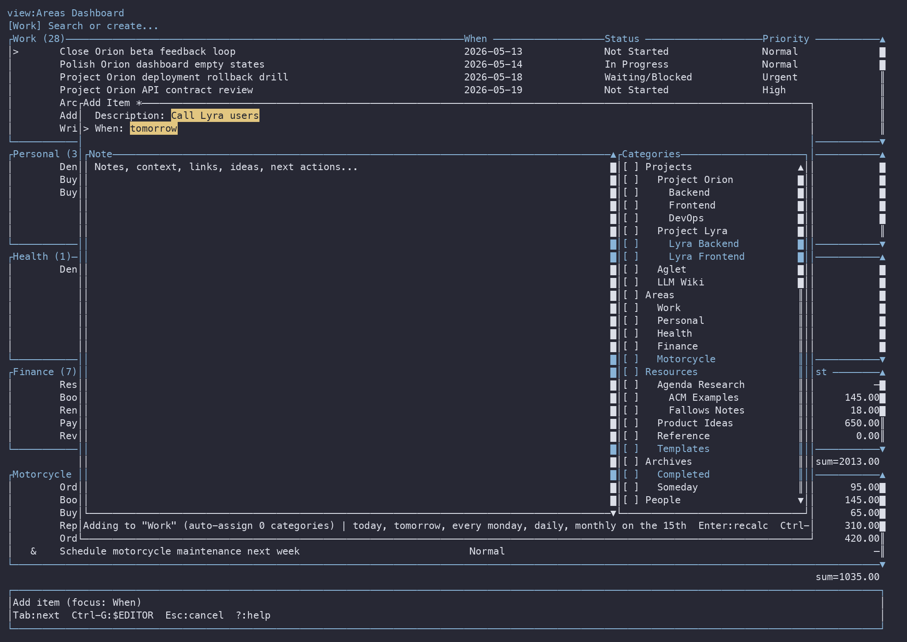

<!-- GENERATED from docs/src/.htm — DO NOT EDIT. Run   MD   aglet-cli.md in docs/. -->

# Aglet TUI Guide

[« Home](index.md)  \| 
[Concepts](aglet-manual.md)  \| 
[CLI Reference](aglet-cli.md)

## How to Use This Manual

Purpose  
Complete guide to the aglet terminal interface: keybindings, interactive
workflows, and the view/category editors. For scripting and batch use see
the [CLI Reference](aglet-cli.md). Core concepts are in the
[Concepts Reference](aglet-manual.md).

**See also**   [Home](index.md)

## Keys and Commands

### TUI: Normal Mode Keys

**Purpose** Normal mode is the main board where items are displayed. These keys work while the highlight is on an item or column.

**Items**

|                 |                                                 |
|-----------------|-------------------------------------------------|
| `n`             | Add a new item to the focused section           |
| `e` / `Enter`   | Edit selected item (Enter adds when empty)      |
| `a`             | Assign categories to current item or selection  |
| `d` / `D`       | Toggle done on selected item(s)                 |
| `r` / `x`       | Remove from view / delete selected item(s)      |
| `b` / `B`       | Open dependency link wizard (blocked-by/blocks) |
| `=`             | Classify selected item(s) now                   |
| `p` / `i` / `o` | Toggle preview sidebar / cycle preview mode     |

**Selection**

|                       |                                         |
|-----------------------|-----------------------------------------|
| `Space`               | Toggle selection on current item        |
| `a` / `d` / `x` / `=` | Batch assign, done, delete, or classify |
| `b` / `B`             | Link selected items with a dependency   |
| `Esc`                 | Clear selection                         |

**Navigation**

|  |  |
|----|----|
| `Up`/`k` `Down`/`j` | Move between items; scroll preview when focused |
| `Left`/`h` `Right`/`l` | Move between sections or columns |
| `Tab` / `S-Tab` | Next / previous section (J/K jump section) |
| `[` / `]` | Move item to previous / next section (or S-Up/S-Down) |
| `m` / `z` | Cycle lane layout / card size |

**Search**

|       |                                 |
|-------|---------------------------------|
| `/`   | Search the focused section      |
| `g/`  | Search all sections             |
| `Esc` | Clear the active section filter |

**Columns**

|                        |                                               |
|------------------------|-----------------------------------------------|
| `Enter`                | Edit column value (on a column cell)          |
| `+` / `-`              | Add / remove a board column                   |
| `H` / `L`              | Move board column left / right                |
| `f`                    | Cycle numeric column format                   |
| `F`                    | Cycle column summary (Sum/Avg/Min/Max)        |
| `s` / `S` or `<` / `>` | Sort section by column (ascending/descending) |

**Views**

|                  |                            |
|------------------|----------------------------|
| `v` / `V` / `F8` | Open the view picker       |
| `,` / `.`        | Previous / next view       |
| `ga`             | Jump to the All Items view |

**Datebook**

|           |                                  |
|-----------|----------------------------------|
| `{` / `}` | Step previous / next date bucket |
| `(` / `)` | Step the browse window           |
| `0`       | Jump to today                    |

**Global**

|                |                                           |
|----------------|-------------------------------------------|
| `C`            | Review pending classification suggestions |
| `g s` / `F10`  | Open Global Settings                      |
| `c` / `F9`     | Open the category manager                 |
| `u`            | Toggle the hide-dependent-items filter    |
| `Ctrl-L`       | Reload data from disk                     |
| `Ctrl-Z`       | Undo                                      |
| `Ctrl-Shift-Z` | Redo                                      |
| `?`            | Toggle the help panel                     |
| `q`            | Quit                                      |

**See also**  
[Category manager keys](#tui-category-manager-keys),
[View editor keys](#tui-view-editor-keys),
[Select multiple items](#select-multiple-items)

### TUI: Category Manager Keys

**Purpose** The category manager is a full-screen mode for working with the category hierarchy. Open it with `c` or `F9`; press `Esc` to return.

**Navigation**

|                     |                                                  |
|---------------------|--------------------------------------------------|
| `Up`/`k` `Down`/`j` | Move through the category tree                   |
| `Tab`               | Move focus between the tree and the details pane |

**Edit**

|                |                                         |
|----------------|-----------------------------------------|
| `n`            | Create a sibling at the selected level  |
| `N`            | Create a child of the selected category |
| `e` / `F2`     | Edit the selected category name         |
| `S` / `Ctrl-S` | Save category edits                     |
| `Esc`          | Return to the main view                 |

**Reorder**

|                       |                                                |
|-----------------------|------------------------------------------------|
| `H` / `J` / `K` / `L` | Reorder the selected category                  |
| `<<` / `>>`           | Change the category's depth (promote / demote) |

**Details** The details pane shows flags (Exclusive, Auto-match, Actionable), the value type (Tag or Numeric), conditions, actions, and a free-form note. Workflow roles (such as the claim category) are set in Global Settings.

**See also**  
[Categories](aglet-manual.md#categories),
[Organize the category hierarchy](#organize-the-hierarchy),
[Actions](aglet-cli.md#actions)

### TUI: View Editor Keys

**Purpose** The view editor configures a view's filter criteria, sections, columns, layout, and aliases.

**Navigation**

|  |  |
|----|----|
| `Tab` | Move between the editor regions (such as SECTIONS and DETAILS) |
| `Up`/`k` `Down`/`j` | Move within a region |

**Edit** Edit criteria (include / exclude / OR-include), date ranges, display mode (single-line or multi-line), section flow (vertical stacked or horizontal lanes), unmatched-item visibility, and category aliases.

**Save**

|                |                       |
|----------------|-----------------------|
| `S` / `Ctrl-S` | Save the view         |
| `Esc`          | Cancel without saving |

**Note** Section and per-section filters are reset when you switch views or save the editor.

**See also**  
[Views](aglet-manual.md#views),
[Create a view](#create-a-view),
[View criteria](#view-criteria),
[View aliases](#view-aliases)

### TUI: Item Editor Keys

**Purpose** The item editor (opened with `n` to add or `e` to edit) is a panel with a title field, a note field, and an inline category list.

**Fields**

|                 |                                                        |
|-----------------|--------------------------------------------------------|
| `Tab` / `S-Tab` | Cycle focus: Title → Note → Categories → Save → Cancel |
| `Ctrl-S`        | Save from any field                                    |
| `Enter`         | Save from the title field                              |
| `Esc`           | Cancel                                                 |

**Categories**

Within the inline category list:

|           |                              |
|-----------|------------------------------|
| `j` / `k` | Move through categories      |
| `Space`   | Toggle a tag assignment      |
| `/`       | Filter the category list     |
| `n`       | Create a new category inline |

(a numeric category shows an inline editable value field)

**Notes** `Ctrl-G` opens `$EDITOR` to edit the title or note in your external editor.

**See also**  
[Add an item](#add-an-item),
[Edit an item](#edit-an-item),
[Add a note](#add-a-note-to-an-item),
[Assign a category](#assign-a-category)

### TUI: Datebook Keys

**Purpose** A datebook view buckets dated items into calendar ranges. These keys move the visible date window.

**Keys**

|     |                                  |
|-----|----------------------------------|
| `{` | Step to the previous date bucket |
| `}` | Step to the next date bucket     |
| `(` | Step the browse window backward  |
| `)` | Step the browse window forward   |
| `0` | Jump to today                    |

**Note** A datebook view groups items by a date source (When, Entry, Done, or a date category) over a period such as day, week, or month.

**See also**  
[Datebook views](aglet-manual.md#datebook-views),
[Create a datebook view](#create-a-datebook-view),
[Browse a datebook view](#browse-a-datebook-view)

## Working with Items

### Add an Item

<figure>

<figcaption aria-hidden="true">The item editor: a title, a note, and an inline category checklist.</figcaption>
</figure>

Purpose  
Add a new item to the database. An item is a single line of free-form text,
optionally with a longer note.

TUI steps  
1.  Press `n` to open the new-item editor (the item is added to
    the focused section).
2.  Type the item text, such as "Review Work budget Friday".
3.  Press `Tab` to move to the Note field and the inline category
    checklist if you want to add detail or assignments.
4.  Press `Ctrl-S` to save from any field. Enter also saves from
    the title field; Esc cancels.

CLI steps  
    aglet add "Review Work budget Friday"
    aglet add "Pay insurance" --note "Renews annually in March"

How it works  
When an item is saved, aglet scans its text and note against category names.
Categories whose names appear are assigned automatically (see Automatic
assignment), and recognizable dates are parsed into the When date. The CLI
prints the new item id and a new_assignments count.

Note  
Short item-id prefixes returned by `aglet add` can be used
anywhere an item id is accepted. Parse the "created " line for the id; it is
not always the last line of output.

**See also**  
[Items](aglet-manual.md#items),
[Edit an item](#edit-an-item),
[Automatic assignment](aglet-manual.md#automatic-assignment),
[Add a note](#add-a-note-to-an-item),
[Item editor keys](#tui-item-editor-keys)

### Edit an Item

Purpose  
Change an item's text, note, or done state.

TUI steps  
1.  Select the item.
2.  Press `e` (or `Enter`) to open the editor.
3.  Edit the text or Tab to the note. Toggle inline category assignments if
    desired.
4.  Press `Ctrl-S` to save, `Esc` to cancel.

CLI steps  
    aglet edit <ITEM> --text "New title"
    aglet edit <ITEM> --note "Updated note text"
    aglet edit <ITEM> --done            # mark done
    aglet edit <ITEM> --not-done        # reopen

How it works  
Editing text re-runs automatic assignment: implicit-string matches may be
added or evicted, but manual and accepted-suggestion assignments stay
sticky. Press `Ctrl-G` in the TUI text or note field to open the
item in `$EDITOR`.

Note  
On an empty section, pressing Enter starts a new item rather than
editing.

**See also**  
[Add an item](#add-an-item),
[Add a note](#add-a-note-to-an-item),
[Mark an item done](#mark-an-item-done),
[Automatic assignment](aglet-manual.md#automatic-assignment)

### Add a Note to an Item

Purpose  
Attach a longer body of text to an item. Notes hold detail that does not
belong in the one-line title.

TUI steps  
1.  Open the item with `e` (or `n` for a new item).
2.  Press `Tab` to move from the title to the Note field.
3.  Type freely; the note is multi-line.
4.  Press `Ctrl-G` to edit the note in `$EDITOR` for
    longer text.
5.  Press `Ctrl-S` to save.

CLI steps  
    aglet add "Plan offsite" --note "Book venue, send agenda"
    aglet edit <ITEM> --note "Revised plan"

How it works  
Note text participates in automatic assignment: a category name appearing
only in the note still triggers an implicit-string match. Inspect
`aglet show` provenance before assuming a visible category was
assigned manually.

Note  
In compact list output an item with a note shows a note marker; use
`--verbose` or `aglet show` to read the full note.

**See also**  
[Notes](aglet-manual.md#notes),
[Edit an item](#edit-an-item),
[Automatic assignment](aglet-manual.md#automatic-assignment)

### Mark an Item Done

Purpose  
Record that an item is complete. Done is a reserved category that also
drives recurrence and dependency resolution.

TUI steps  
Select an item (or several with `Space`) and press `d`
to toggle done. `D` toggles done on the whole current
selection.

CLI steps  
    aglet edit <ITEM> --done
    aglet edit <ITEM> --not-done

How it works  
Completing an item assigns the reserved Done category. A done prerequisite
no longer blocks items that depend on it. If the item carries a recurrence
rule, completing it schedules the next occurrence (see Recurrence).

Note  
Done items are hidden from most views that exclude Done and from
`aglet list` unless you pass `--include-done`.

**See also**  
[Reserved categories](aglet-manual.md#reserved-categories),
[Recurrence](#recurrence),
[Dependencies](aglet-manual.md#dependencies)

### Recurrence

Purpose  
Make an item repeat on a schedule. When a recurring item is completed, aglet
generates the next occurrence automatically.

How it works  
A recurrence rule is attached to a dated item. Completing the current
occurrence (marking it Done) advances the When date to the next scheduled
date and reopens the item, so recurring chores, bills, and maintenance
reappear without re-entry.

Examples  
A monthly "Pay insurance" item set to recur reappears with next month's date
each time you mark it done.

Note  
Recurrence works together with the reserved When and Done categories.

**See also**  
[Mark an item done](#mark-an-item-done),
[Reserved categories](aglet-manual.md#reserved-categories),
[Datebook views](aglet-manual.md#datebook-views)

### Delete an Item

Purpose  
Remove an item from the database. Deletion is logged so the item can be
restored.

TUI steps  
Select the item(s) and press `x` to delete. (Press `r`
to remove an item from the current view without deleting it from the
database.)

CLI steps  
    aglet delete <ITEM>
    aglet deleted              # list deletion-log entries
    aglet restore <LOG_ID>    # restore by log entry id

How it works  
Deleting writes a deletion-log entry rather than erasing the item
immediately. `aglet deleted` lists log entries with their ids;
`aglet restore` brings an item back.

Note  
`r` (remove from view) and `x` (delete) are different.
Remove only changes view membership; delete affects the whole database.

**See also**  
[Restore a deleted item](#restore-a-deleted-item),
[Items](aglet-manual.md#items),
[CLI item commands](aglet-cli.md#cli-item-commands)

### Restore a Deleted Item

Purpose  
Bring back an item that was deleted, using the deletion log.

CLI steps  
    aglet deleted               # find the log entry id
    aglet restore <LOG_ID>      # restore that entry

How it works  
Every delete appends an entry to the deletion log. Restoring recreates the
item with its text, note, and recorded state.

Note  
Restore brings the item back exactly as it was deleted; the deletion log
keeps a history you can recover from.

**See also**  
[Delete an item](#delete-an-item),
[CLI item commands](aglet-cli.md#cli-item-commands)

### Move an Item Between Sections

Purpose  
Reposition an item into a different section of the current view.

TUI steps  
Select the item and press `[` to move it to the previous section
or `]` to move it to the next section. Shift-Up and Shift-Down do
the same. Use `h`/`l` (or Left/Right) to move between
sections or columns, and `Tab` / `Shift-Tab` to move
focus between sections.

How it works  
Sections in a standard view are defined by category criteria. Moving an item
between sections adjusts its category assignments so it matches the
destination section's criteria.

Note  
In horizontal (kanban) lane layouts, moving an item between lanes is the
same operation; aglet remembers the per-lane selection.

**See also**  
[Sections](aglet-manual.md#sections),
[Add a section](#add-a-section),
[Normal mode keys](#tui-normal-mode-keys)

### Search Items

Purpose  
Find items by text in their title or note.

TUI steps  
Press `/` to search within the focused section, or `g/`
to search across all sections. Type the query; press `Esc` to
clear the active section filter.

CLI steps  
    aglet search "budget"
    aglet search "budget" --not-blocked

How it works  
CLI and TUI search both route through the same matcher over item title and
note text. Per-section filters in the TUI are scoped to the focused section
and reset on view switch.

Note  
Search matches note text, so a query can match items whose title does not
contain the term.

**See also**  
[Items](aglet-manual.md#items),
[Select multiple items](#select-multiple-items),
[CLI filtering](aglet-cli.md#cli-filtering)

### Select Multiple Items

Purpose  
Operate on several items at once — assign, complete, delete, or classify
them together.

TUI steps  
1.  Press `Space` to toggle selection on the current item; repeat
    to build a selection.
2.  Apply a batch operation: `a` (assign categories),
    `d` (done), `x` (delete), `=` (classify
    now), or `b` / `B` (link with a dependency).
3.  Press `Esc` to clear the selection.

How it works  
Selection lets a single command act on many items at once. Batch operations
act on every selected item.

Note  
With no explicit selection, the same keys act on the single item under the
cursor.

**See also**  
[Assign a category](#assign-a-category),
[Mark an item done](#mark-an-item-done),
[Create a dependency](#create-a-dependency),
[Review suggestions](#review-classification-suggestions)

## Working with Categories

### Add a Category

<figure>

<figcaption aria-hidden="true">The category manager: hierarchy at left; flags, match rules, and actions at right.</figcaption>
</figure>

Purpose  
Create a new category — the basic filing unit. Categories can be top-level
or nested under a parent.

TUI steps  
1.  Press `c` or `F9` to open the category manager.
2.  Press `n` to create a category at the selected level, or
    `N` to create a child of the selected category.
3.  Type the name (Work, Personal, Urgent, ...).
4.  Adjust flags such as exclusive, implicit matching, and notes in the
    details pane.
5.  Press `Ctrl-S` to save, `Esc` to return.

CLI steps  
    aglet category create "Work"
    aglet category create "High" --parent Priority
    aglet category create "Priority" --exclusive
    aglet category create "Cost" --type numeric

Note  
The reserved names Done, When, and Entry cannot be used. For a workflow
child under an exclusive Status parent, use names such as Complete or
Completed, not Done.

**See also**  
[Categories](aglet-manual.md#categories),
[Tag categories](aglet-manual.md#tag-categories),
[Numeric categories](aglet-manual.md#numeric-categories),
[Exclusive categories](aglet-manual.md#exclusive-categories),
[Organize the hierarchy](#organize-the-hierarchy)

### Assign a Category to an Item

Purpose  
Manually file an item under a category.

TUI steps  
1.  Select the item (or several with `Space`).
2.  Press `a` to open the inline category picker.
3.  Press `Space` to toggle a category's assignment without
    closing, or `Enter` to apply the current result and close.
4.  Press `/` to filter; from the filter box Tab, Shift-Tab, Up,
    or Down returns focus to the narrowed list.

CLI steps  
    aglet category assign <ITEM> Work
    aglet category assign <ITEM> High

How it works  
Manual assignments are durable user choices: they stay sticky even when text
changes. Assigning a child also displays its parent (assigning High also
shows Priority). For exclusive parents, only one child can be assigned.

Note  
Use the inline checklist in the item editor to assign categories while
adding or editing an item.

**See also**  
[Unassign a category](#unassign-a-category),
[Automatic assignment](aglet-manual.md#automatic-assignment),
[Exclusive categories](aglet-manual.md#exclusive-categories),
[Set a numeric value](#set-a-numeric-value)

### Unassign a Category

Purpose  
Remove a category from an item.

TUI steps  
Press `a` on the item, then `Space` on the assigned
category to toggle it off; `Enter` applies and closes.

CLI steps  
    aglet category unassign <ITEM> Work

How it works  
Unassigning removes the explicit assignment row and reprocesses the item. If
the category still matches by implicit string or profile condition, a live
(non-sticky) assignment may reappear; sticky manual/action/accepted-suggestion
assignments do not.

Note  
To stop a category from auto-matching entirely, turn off its implicit-string
matching rather than repeatedly unassigning.

**See also**  
[Assign a category](#assign-a-category),
[Automatic assignment](aglet-manual.md#automatic-assignment),
[Discard a category](#discard-a-category)

### Review Classification Suggestions

Purpose  
Accept or reject category suggestions, including experimental LLM-based
ones, before they are applied.

TUI steps  
Press `=` to classify the selected item(s) now. Press
`C` to review pending classification suggestions in the
suggestion-review mode, where you can accept or dismiss each one.

How it works  
Classification proposes categories for an item from its text and rules.
Accepting a suggestion creates a sticky assignment; dismissing it does not.
It runs aglet's rule-based and LLM-based suggestions on demand for
review.

Note  
aglet has experimental support for LLM-based categorization in addition to
implicit-string and profile-condition matching.

**See also**  
[Automatic assignment](aglet-manual.md#automatic-assignment),
[Profile conditions](aglet-cli.md#profile-conditions),
[Assign a category](#assign-a-category)

### Set a Numeric Value

Purpose  
Give an item a number under a numeric category — a cost, quantity, mileage,
or effort estimate.

TUI steps  
On a numeric column cell, press `Enter` to edit the value inline.
In the item editor's inline category list, an assigned numeric category
shows `- [N]` with an editable value field.

CLI steps  
    aglet category set-value <ITEM> Cost 450.00

How it works  
The value is stored on the assignment edge between the item and the numeric
category. A numeric column then displays the value and can be summarized per
section (sum, average, min, max).

Note  
Editing a numeric column cell is the primary way to assign a value to an
item for the first time.

**See also**  
[Numeric categories](aglet-manual.md#numeric-categories),
[Format a numeric column](#format-a-numeric-column),
[Column summaries](#column-summaries),
[Add a column](#add-a-column)

### Format a Numeric Column

Purpose  
Control how a numeric category's values are displayed — decimal places,
currency, and thousands separators.

TUI steps  
On a numeric column, press `f` to cycle the column's display
format.

CLI steps  
    aglet category format <CATEGORY> ...

How it works  
Formatting is a display property of the numeric category; it does not change
the stored value. The same value can appear as 1450, 1,450.00, or
\$1,450.00 depending on format.

Note  
Use `F` (capital) to cycle the column's summary function;
`f` sets the value format. See Column summaries.

**See also**  
[Numeric categories](aglet-manual.md#numeric-categories),
[Set a numeric value](#set-a-numeric-value),
[Column summaries](#column-summaries)

### Organize the Category Hierarchy

Purpose  
Rearrange categories — reparent, promote, demote, and reorder siblings.

TUI steps  
In the category manager, use `H/J/K/L` to reorder and move
categories, and `<<` / `>>` to change a
category's depth level.

CLI steps  
    aglet category reparent <CATEGORY> --parent <NEW_PARENT>
    aglet category reparent <CATEGORY> --root      # make top-level
    aglet category rename <CATEGORY> "New Name"

How it works  
Child order matters for exclusive parents: when several derived siblings
match, the earlier child in parent order wins. Manual and accepted-suggestion
assignments remain durable regardless of order.

Note  
Workflow roles (which categories mean Ready, claim-target, etc.) are set in
Global Settings, not by hierarchy position.

**See also**  
[The category hierarchy](aglet-manual.md#the-category-hierarchy),
[Exclusive categories](aglet-manual.md#exclusive-categories),
[Subsumption](aglet-manual.md#subsumption),
[Global settings](#global-settings)

### Discard a Category

Purpose  
Delete a category you no longer need.

TUI steps  
In the category manager, select the category and delete it.

CLI steps  
    aglet category delete "Old Category"

How it works  
Deleting a category removes it and its assignments. Reserved categories
(Done, When, Entry) cannot be deleted.

Note  
Consider turning off implicit matching instead of deleting if you only want
to stop auto-assignment but keep past filings.

**See also**  
[Add a category](#add-a-category),
[Unassign a category](#unassign-a-category),
[Reserved categories](aglet-manual.md#reserved-categories)

## Working with Views

### Create a View

<figure>

<figcaption aria-hidden="true">A saved view grouping items by project, with an Effort column and per-section totals.</figcaption>
</figure>

Purpose  
Save a lens over the item database — a filtered, sectioned, and columned
presentation you can return to.

TUI steps  
1.  Press `v`, `V`, or `F8` to open the
    view picker.
2.  Press `n` to create a new view and name it (Work Queue).
3.  Add include/exclude criteria and any sections.
4.  Press `Ctrl-S` (or `S`) to save.

CLI steps  
    aglet view create "Work Queue" --include Work --exclude Done
    aglet view list
    aglet view show "Work Queue"

How it works  
A view stores its criteria, sections, columns, layout, and aliases. It
updates automatically as items are added or reassigned.

Note  
Include criteria are AND-based: `--include Work --include Urgent`
matches only items with both categories.

**See also**  
[Views](aglet-manual.md#views),
[View criteria](#view-criteria),
[Add a section](#add-a-section),
[The view editor](#the-view-editor),
[Clone a view](#clone-a-view)

### View Criteria

Purpose  
Control which items a view includes.

CLI steps  
    aglet view create "My View" --include High --include Pending
    aglet view edit <VIEW> ...

How it works  
Include filters are AND-based — every included category must be present. Do
not use repeated includes for mutually exclusive siblings such as Pending
and In Progress; use separate sections or views instead. Views also persist
hide_dependent_items, which hides items that are blocked dependents.

Note  
Toggle the hide-dependent-items filter in the TUI with `u`.

**See also**  
[Create a view](#create-a-view),
[CLI filtering](aglet-cli.md#cli-filtering),
[Filter blocked items](#filter-blocked-items),
[Add a section](#add-a-section)

### Add a Section to a View

Purpose  
Group a view's items into labelled lanes by category criteria.

CLI steps  
    aglet view section add <VIEW> ...
    aglet view section update <VIEW> ...
    aglet view section remove <VIEW> ...

TUI steps  
Open the view editor (from the view picker), focus the SECTIONS pane, and
add or edit sections there.

How it works  
Each section has its own include criteria. Items that match land in that
section; section flow can be vertical (stacked) or horizontal (kanban
lanes). Unmatched-item visibility is a view setting.

Note  
Moving an item between sections adjusts its category assignments to match
the destination section.

**See also**  
[Sections](aglet-manual.md#sections),
[Add a column](#add-a-column),
[Move an item between sections](#move-an-item-between-sections),
[The view editor](#the-view-editor)

### Add a Column to a Section

Purpose  
Show a numeric category's value as a column beside each item, with an
optional per-section summary.

TUI steps  
Press `+` to add a board column and `-` to remove one.
Use `H` / `L` to move a column left or right, and
`Enter` on a column cell to edit a value.

CLI steps  
    aglet view column add <VIEW> ...
    aglet view column update <VIEW> ...
    aglet view column remove <VIEW> ...

How it works  
Columns display numeric category values. Each column can carry a summary
function shown in the section footer.

Note  
Columns are numeric in aglet; there is no free-text column type.

**See also**  
[Columns](aglet-manual.md#columns),
[Column summaries](#column-summaries),
[Set a numeric value](#set-a-numeric-value),
[Format a numeric column](#format-a-numeric-column)

### Column Summary Functions

Purpose  
Aggregate a numeric column across a section — a total, average, or
extreme.

TUI steps  
Press `F` to cycle a numeric column's summary (Sum / Avg / Min /
Max). Sort a section by a column with `s` / `S` (or
`<` / `>`).

CLI steps  
    aglet view set-summary <VIEW> ...

How it works  
The summary is computed over the items in the section and shown in the
section footer — for example a budget total or average effort.

Note  
`f` cycles the value display format; `F` cycles the
summary function.

**See also**  
[Add a column](#add-a-column),
[Numeric categories](aglet-manual.md#numeric-categories),
[Format a numeric column](#format-a-numeric-column)

### Create a Datebook View

Purpose  
Build a view that buckets dated items into calendar ranges.

CLI steps  
    aglet view create-datebook "Scheduling" ...

How it works  
A datebook view is a distinct view type that groups items by their When date
into date-interval buckets (days, weeks, etc.). It is ideal for upcoming
work, appointments, renewals, and deadlines.

Note  
A standard view and a datebook view are different types; one cannot be
converted into the other.

**See also**  
[Datebook views](aglet-manual.md#datebook-views),
[Browse a datebook view](#browse-a-datebook-view),
[Date conditions](aglet-cli.md#date-conditions),
[Datebook keys](#tui-datebook-keys)

### Browse a Datebook View

Purpose  
Move the visible date window of a datebook view forward and back.

TUI steps  
`{` and `}` step to the previous / next bucket.
`(` and `)` step the window. `0` jumps to
today.

CLI steps  
    aglet view datebook-browse <VIEW> ...

How it works  
Browsing shifts which date interval is shown without changing the view
definition.

Note  
`0` (today) is the quickest way to recenter after browsing.

**See also**  
[Create a datebook view](#create-a-datebook-view),
[Datebook views](aglet-manual.md#datebook-views),
[Datebook keys](#tui-datebook-keys)

### The View Editor

<figure>

<figcaption aria-hidden="true">The view editor: filter criteria, the section pane, and a live preview.</figcaption>
</figure>

Purpose  
Configure a view's filters, sections, columns, layout, aliases, and preview
behavior in one screen.

TUI steps  
Open a view in the editor from the view picker. `Tab` moves
between regions (Criteria, Datebook, Sections, Unmatched). `Enter`
operates the focused row or inline input. Save with `S` or
`Ctrl-S`.

How it works  
The editor edits mutable view properties: include/exclude criteria, date
ranges, display mode (single- or multi-line), section flow (stacked or
lanes), unmatched-item visibility, and category aliases. A live preview
reflects changes.

Note  
The All Items view is immutable; clone it first to edit a copy.

**See also**  
[Create a view](#create-a-view),
[View criteria](#view-criteria),
[Add a section](#add-a-section),
[View aliases](#view-aliases),
[View editor keys](#tui-view-editor-keys)

### View Aliases

Purpose  
Show a category under a different display name inside one view, without
changing the category itself.

CLI steps  
    aglet view alias set <VIEW> <CATEGORY> "Display Name"
    aglet view alias clear <VIEW> <CATEGORY>

How it works  
An alias is per-view display metadata mapping a category to a label. It
affects only how the category is shown in that view.

Note  
Aliases do not change category identity, filters, section titles, generated
subsection labels, or board column headings.

**See also**  
[The view editor](#the-view-editor),
[Views](aglet-manual.md#views),
[CLI view commands](aglet-cli.md#cli-view-commands)

### Clone a View

Purpose  
Make an editable copy of an existing view, including the immutable All Items
view.

CLI steps  
    aglet view clone "All Items" "My Items"

How it works  
Cloning copies the source view's criteria, sections, columns, and settings
into a new, mutable view that you can then customize.

Note  
Cloning is the way to start from All Items, which cannot itself be
edited.

**See also**  
[Create a view](#create-a-view),
[The All Items view](aglet-manual.md#the-all-items-view),
[Discard a view](#discard-a-view)

### Discard a View

Purpose  
Delete a view you no longer need.

CLI steps  
    aglet view delete "Old View"
    aglet view rename "Old Name" "New Name"

How it works  
Deleting a view removes the saved presentation only; the items it showed
remain in the database. The All Items view cannot be deleted.

Note  
Deleting a view never deletes items — it only discards the lens.

**See also**  
[Create a view](#create-a-view),
[Clone a view](#clone-a-view),
[The All Items view](aglet-manual.md#the-all-items-view)

## Working with Dependencies

### Create a Dependency Link

Purpose  
Record that one item must wait for another, or relate two items.

TUI steps  
Press `b` or `B` on an item (or selection) to open the
dependency link wizard and choose the blocked-by / blocks relationship.

CLI steps  
    aglet link depends-on <ITEM> <PREREQUISITE>
    aglet link blocks <BLOCKER> <BLOCKED>
    aglet link related <ITEM_A> <ITEM_B>

How it works  
depends-on and blocks are two vocabularies for the same directed
relationship; related is bidirectional. An item with an unresolved
depends-on prerequisite is "blocked". Done prerequisites do not block.

Note  
Do not create synthetic links to mean "someone is working on this" — use
claim for that. Links are for real prerequisites.

**See also**  
[Dependencies](aglet-manual.md#dependencies),
[Remove a link](#remove-a-link),
[Filter blocked items](#filter-blocked-items),
[The link wizard](#the-link-wizard)

### Remove a Link

Purpose  
Delete a dependency or related link between two items.

CLI steps  
    aglet unlink depends-on <ITEM> <PREREQUISITE>
    aglet unlink blocks <BLOCKER> <BLOCKED>
    aglet unlink related <ITEM_A> <ITEM_B>

How it works  
Removing the last unresolved depends-on prerequisite unblocks the dependent
item, which can make it claimable again.

Note  
unlink is the canonical entry point; the depends-on and blocks forms remove
the same underlying relationship from either direction.

**See also**  
[Create a dependency](#create-a-dependency),
[Dependencies](aglet-manual.md#dependencies),
[Filter blocked items](#filter-blocked-items)

### Filter Blocked / Not-Blocked Items

Purpose  
Show only items that are waiting on a prerequisite, or only those that are
free to start.

TUI steps  
Press `u` to toggle the hide-dependent-items filter for the
current view.

CLI steps  
    aglet list --blocked
    aglet list --not-blocked
    aglet search <query> --blocked
    aglet view show "<name>" --not-blocked

How it works  
blocked means the item has at least one unresolved depends-on prerequisite,
computed at query time from the dependency graph. Done dependencies do not
count.

Note  
Dependency-state filters are derived, not assignable categories; you cannot
assign "blocked" to an item.

**See also**  
[Dependencies](aglet-manual.md#dependencies),
[Create a dependency](#create-a-dependency),
[The ready list](aglet-cli.md#the-ready-list),
[CLI filtering](aglet-cli.md#cli-filtering)

### The Link Wizard

Purpose  
Create dependency links interactively in the TUI.

TUI steps  
Press `b` or `B` on an item or a multi-item selection
to open the wizard, then pick the other item and the relationship direction
(blocked-by or blocks).

How it works  
The wizard writes the same depends-on / blocks links as the CLI. With a
selection, it can link several items at once.

Note  
Use the wizard for prerequisites; use claim/release for "who is working on
it".

**See also**  
[Create a dependency](#create-a-dependency),
[Select multiple items](#select-multiple-items),
[CLI link commands](aglet-cli.md#cli-link-commands)

## Settings and Indicators

### Global Settings

Purpose  
Adjust application-wide preferences and workflow roles.

TUI steps  
Press `g s` or `F10` to open Global Settings.

How it works  
Global Settings control display and behavior preferences such as
auto-refresh, section borders, note glyphs, and search mode, and they define
workflow roles — which categories act as Ready and as the claim target used
by claim/release/ready.

Note  
Workflow roles live here, not in the category hierarchy; reorder or rename
categories without changing which one is "Ready".

**See also**  
[Claim an item](aglet-cli.md#claim-an-item),
[The ready list](aglet-cli.md#the-ready-list),
[Organize the hierarchy](#organize-the-hierarchy)

### The Status and Hint Footer

Purpose  
Read the two-row footer at the bottom of the TUI.

How it works  
The footer has two rows. The top row shows transient status — the result of
your last action or a brief message. The bottom row shows persistent key
hints for the current mode, so the available keys change as you move between
Normal view, the category manager, the view editor, and the item
editor.

Note  
Press `?` at any time to open the full in-app help panel, which
lists every key for the current context.

**See also**  
[Normal mode keys](#tui-normal-mode-keys),
[Assignment profile](#assignment-profile)

### The Item Assignment Profile

Purpose  
Understand the assignments and provenance shown by `aglet show`.

How it works  
`aglet show` prints an item's text, note, status, and its
assignments. Displayed category lists include both assigned categories and
their parents (assigning High also shows Priority). Provenance distinguishes
manual assignments from auto-classified ones (implicit_string or other
providers), so you can see why a category is present.

Note  
Implicit matches scan the note as well as the title, so a category can appear
because of text inside the note. Check provenance before assuming a visible
category was set by hand.

**See also**  
[Automatic assignment](aglet-manual.md#automatic-assignment),
[Assign a category](#assign-a-category),
[Categories](aglet-manual.md#categories),
[CLI item commands](aglet-cli.md#cli-item-commands)
